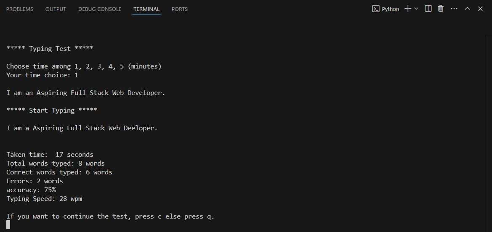

# terminal_based_dsa_Projects
This repository contain Projects like- 
    1. Rock Paper Scissor Game
    2. Terminal based Maze Solver
    3. Terminal based Typing Master
# Typing Master

## Description

Typing Master is a terminal-based application designed to improve typing speed and accuracy. It provides users with a series of random words to type within a set time limit, tracking their performance and providing feedback on their typing skills.

## Features

- Randomized words for typing practice
- Time-based typing challenges
- Real-time feedback on typing speed and accuracy
- Simple and user-friendly terminal interface

## Technology Used
* Python

## Screenshot

